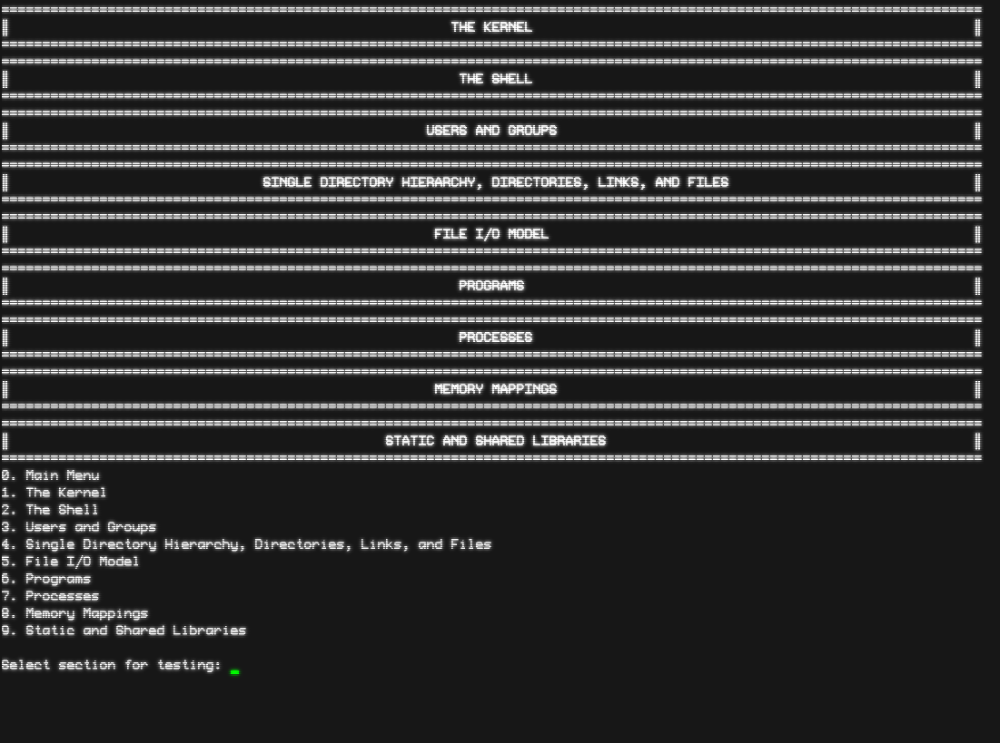
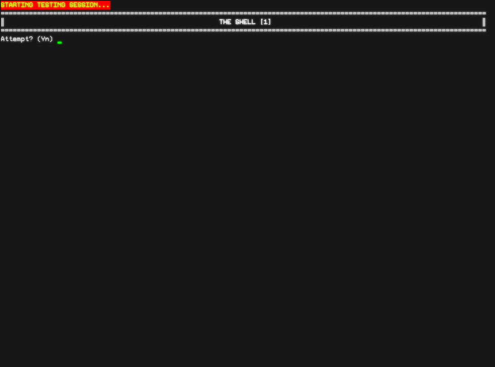
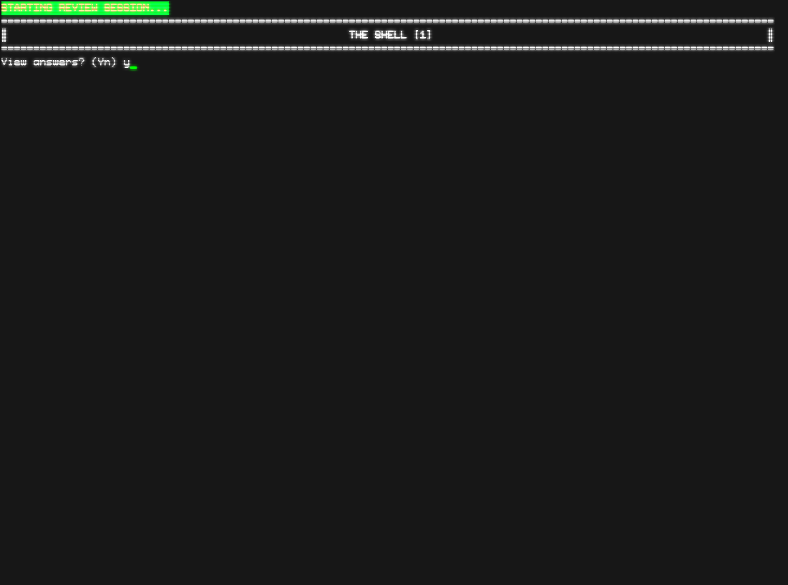

# qna
Just a basic terminal note-processing app in question and answer format.

## Main menu

## Sections processed using markdown subheaders

## Testing confirmation

## Questions and user answers (note blank answer for third question is a skip)

## Review answers confirmation prompt

## Given answer vs true answer for questions that were answered in review

